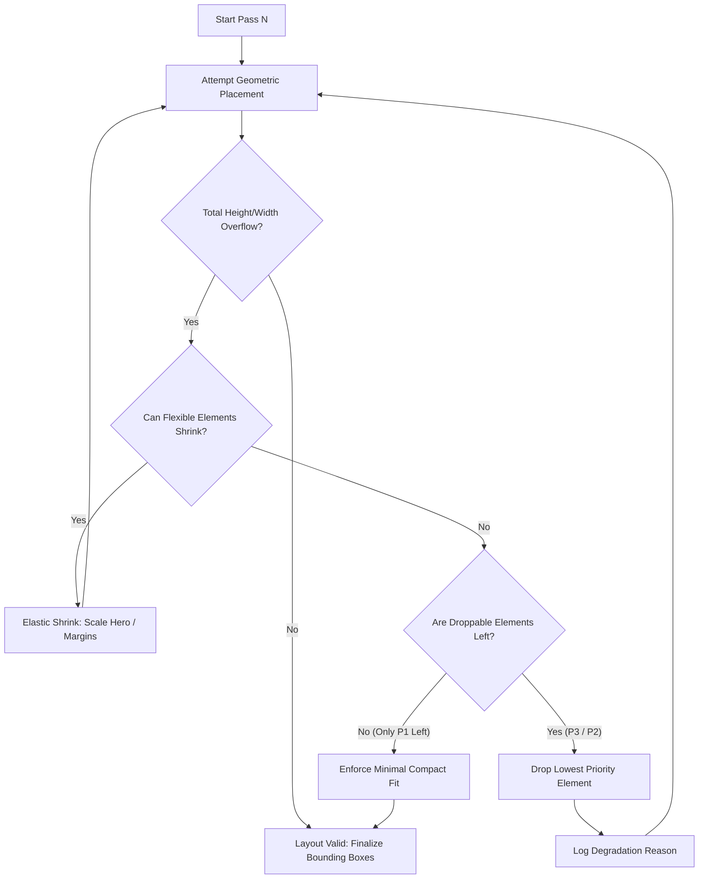

# System Architecture — Adaptive Layout Engine

This document outlines the architectural decisions, constraint solving model, priority degradation pipeline, and multi-target rendering design for the Flam Adaptive Layout Engine.

---

## 1. Architectural Philosophy & Separation of Concerns

The architecture is strictly layered into four independent stages:

```
[Spec Definition]  ──>  [Constraint Resolution]  ──>  [Resolved Layout Output]  ──>  [Renderer]
  (src/spec.ts)           (src/resolver.ts)             (Pure Geometry DTO)          (DOM / Canvas)
```

### Decoupling Invariants:
1. **Spec Independence**: The `AdSpec` contains zero knowledge of viewport widths, heights, or device types.
2. **Surface Independence**: A `SurfaceProfile` contains environmental constraints (viewing distance, safe area, touch target floors) but zero knowledge of ad content.
3. **Solver Purity**: The `resolveLayout` function is a pure function:
   $$\text{resolveLayout}(\text{AdSpec}, \text{SurfaceProfile}) \to \text{ResolvedLayout}$$
   It performs no DOM access, relies on no CSS media queries, and produces a complete geometric data structure of $(x, y, \text{width}, \text{height})$ bounding boxes.
4. **Renderer Agnosticism**: Renderers consume the geometric bounding boxes directly. Switching from `RenderDOM` (React/CSS) to `renderToCanvas` (HTML5 2D Canvas) requires **zero modifications** to the solver.

---

## 2. The Constraint Resolution Algorithm

Rather than relying on brittle lookup tables (`if (surface.name === 'mobile')`), the engine classifies the layout environment using continuous geometric and physical metrics:

### Step 1: Viewport Budget Calculation
$$\text{availW} = \text{surface.width} - (\text{safeArea.left} + \text{safeArea.right})$$
$$\text{availH} = \text{surface.height} - (\text{safeArea.top} + \text{safeArea.bottom})$$
$$\text{AR} = \frac{\text{availW}}{\text{availH}}$$

### Step 2: Continuous Aspect Ratio Topology Selection
The algorithm selects a spatial topology based on $\text{AR}$:

| Aspect Ratio Range | Topology Mode | Structural Layout Strategy |
|---|---|---|
| $\text{AR} \ge 2.2$ | **Extreme Wide** | Horizontal pipeline: `[Logo]` $\to$ `[Hero]` $\to$ `[Headline + Price]` $\to$ `[CTA]` |
| $1.15 \le \text{AR} < 2.2$ | **Wide Split** | Dual-column split: Left hero showcase (44%), Right content/action stack (56%) |
| $0.85 \le \text{AR} < 1.15$ | **Balanced Square** | High-density centered grid: Top logo, large central hero, bottom action card |
| $\text{AR} < 0.85$ | **Tall Portrait** | Vertical cascade: Top logo $\to$ headline $\to$ center hero $\to$ bottom anchor CTA |

### Step 3: Hard Human-Factor Constraint Enforcement
1. **Touch Targets**: If `surface.touchOnly === true`, interactive buttons (`role: 'action'`) enforce $\text{height} \ge \text{surface.minTapTarget}$ (e.g. 48px on mobile, 64px on public kiosks).
2. **Typography Legibility Floor**: If `surface.viewingDistance === 'far'` (e.g. 10-foot TV viewing), text elements scale by $1.4\times$ and enforce $\text{fontSize} \ge \text{surface.minTextSize}$ (e.g. 32px on broadcast).

---

## 3. Priority Degradation Pipeline

When available space is insufficient to accommodate all elements at their ideal sizes, the engine executes a multi-pass degradation loop:



### Degradation Precedence:
- **Priority 3 (Supplemental)**: Dropped first. (e.g. `logo`, `branding`).
- **Priority 2 (High Value)**: Dropped second if space remains cramped. (e.g. `price`, secondary sub-copy).
- **Priority 1 (Critical)**: Protected. (e.g. `headline`, `product-image`, `cta`). The engine will shrink hero visual and margins down to minimum bounds before ever sacrificing Priority 1 elements.

---

## 4. Collision Avoidance & Boundary Containment

Every candidate placement is tested using Axis-Aligned Bounding Box (AABB) intersection:
$$\text{Collision}(R_1, R_2) \iff \neg (R_1.x + R_1.w \le R_2.x \lor R_2.x + R_2.w \le R_1.x \lor R_1.y + R_1.h \le R_2.y \lor R_2.y + R_2.h \le R_1.y)$$

If any collision or viewport boundary overflow occurs:
1. The attempt returns `success: false`.
2. The degradation loop removes the lowest priority item and re-solves.
3. Once satisfied, the final layout is guaranteed to have zero overlaps.

---

## 5. Extensibility: Adding New Surfaces & Renderers

### Adding a New Surface Profile:
Simply pass an object conforming to `SurfaceProfile`:
```typescript
const smartWatchProfile: SurfaceProfile = {
  id: 'smartwatch-round',
  name: 'Circular Smartwatch',
  description: 'Ultra-compact wearable display',
  category: 'custom',
  width: 280,
  height: 280,
  safeArea: { top: 24, bottom: 24, left: 24, right: 24 },
  minTapTarget: 44,
  minTextSize: 12,
  viewingDistance: 'near',
  touchOnly: true,
};
```
The solver consumes it without any code modification in `resolver.ts`.

### Adding a New Renderer (e.g. SVG / WebGL):
The `ResolvedLayout` output contains all necessary metrics:
- `layout.viewport.width` & `height`
- `layout.elements[i].rect` ($x, y, w, h$)
- `layout.elements[i].computedStyles`
Any renderer can loop over `layout.elements.filter(e => e.isVisible)` and draw the boxes.
